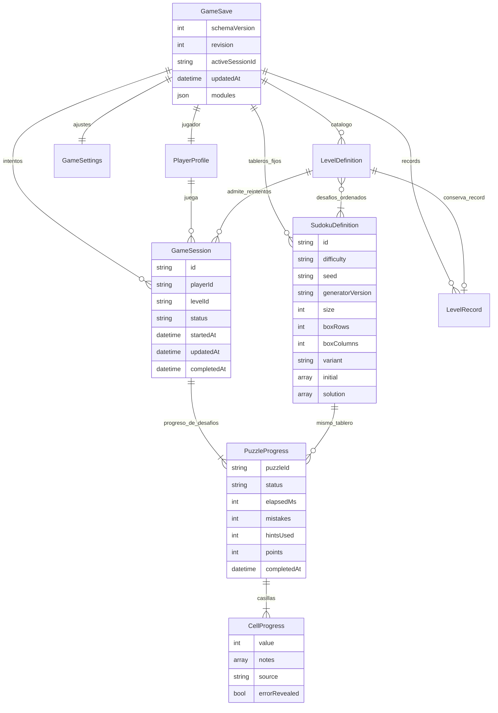
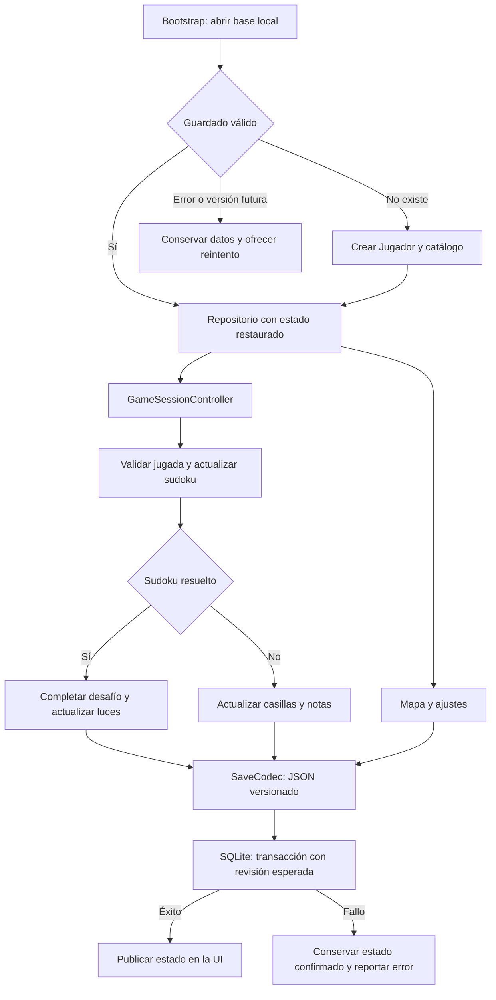

# Guardado local y estados del juego

El progreso se guarda en el dispositivo, sin cuenta ni conexión. El perfil se crea
con un UUID local, nombre **Jugador**, `nameChosen: false` e idioma `es`.
Cambiar el nombre no cambia la identidad ni pierde partidas.

## Modelo de datos



Son relaciones del modelo, no tablas SQL individuales. Un nivel puede existir en
el catálogo antes de registrar sus tableros, pero no se puede iniciar hasta tenerlos.

### Reglas

- Cada nivel del mapa declara **tres sudokus**, en orden. La cantidad sale de
  `puzzleIds.length`; otros niveles pueden tener otra cantidad.
- Cada sudoku completado aporta una luz dentro de ese intento. Al completar todos
  se termina el intento. Los requisitos del siguiente nivel se evalúan sobre los
  mejores resultados guardados.
- Volver a entrar devuelve el intento pendiente. Repetir un nivel terminado crea
  otro intento con los mismos tableros. `restart: true` abandona el pendiente sin
  borrar récords. Se admite un intento pendiente por nivel.
- Las luces conservan el máximo logrado en un intento. No se suman repeticiones
  del mismo sudoku para desbloquear el siguiente nivel.
- La definición guarda tablero inicial, solución, seed y versión del generador.
  No se puede cambiar una definición registrada bajo el mismo ID. La seed es texto
  para evitar diferencias de precisión entre plataformas.
- Las casillas se ordenan por filas: `index = row * size + column`. `null` significa
  vacío. Las pistas fijas se derivan del tablero inicial y no se editan.
- El error actual se calcula contra la solución. `errorRevealed` conserva si se
  mostró; `mistakes` cuenta entradas incorrectas históricas, aunque se borren.
  Reenviar el mismo valor no incrementa el contador.
- Las notas son candidatos únicos y ordenados. Ingresar un número limpia las notas;
  escribir notas deja vacío el valor. Las ayudas usan la solución y conservan
  `source: hint` y el contador de ayudas.
- `points` y `bestPoints` quedan disponibles con valor cero: todavía no se definió
  una fórmula de puntuación adicional a las luces.
- Tiempo y luces del intento se calculan desde sus desafíos. Intentos jugados y
  completados se pueden contar desde `sessions`, sin duplicar contadores.

## Flujo de guardado



`GameRepository` es la entrada de escritura. Serializa operaciones y publica
instantáneas inmutables **después** de confirmar el guardado. `SaveStore` permite
cambiar el almacenamiento sin modificar modelos o pantallas.

SQLite guarda un documento JSON en `game_save`, con `id = 1`, `revision` y `payload`.
Para este juego local pequeño, el documento permite guardar juntos casillas,
finalización y récords. La revisión detecta escrituras desde una instancia que
conserva un estado antiguo y evita sobrescribir cambios más recientes. Un guardado
corrupto o de una versión futura nunca se reemplaza silenciosamente.

`GameSessionController` usa un cronómetro monotónico. Guarda tiempo cada cinco
segundos, antes de cada jugada y al pausar/salir. Lo detiene en segundo plano,
durante escrituras de jugadas y al completar un sudoku. Un cierre forzado puede
perder el intervalo de tiempo aún no confirmado. Nunca cuenta las horas que la app
estuvo cerrada. Una sesión que quedó activa en disco se restaura pausada.

### Plataformas

- Android, iOS y macOS: `sqflite` en el directorio de soporte de la aplicación.
- Linux y Windows: la misma API mediante `sqflite_common_ffi`.
- Web: SQLite WASM persistido en IndexedDB mediante `sqflite_common_ffi_web`.
  Se incluyen `web/sqlite3.wasm` y `web/sqflite_sw.js`. Usar un origen/puerto estable
  al desarrollar: `flutter run -d chrome --web-port 8080`.

El adaptador web está marcado experimental por su autor. Al actualizar SQLite o
el adaptador, regenerar con `dart run sqflite_common_ffi_web:setup --force` y probar
el guardado en navegador. No hay sincronización entre dispositivos. Desinstalar o
borrar datos de la app/navegador puede eliminar el progreso; exportar/importar una
copia queda como extensión futura.

## Conectar la pantalla de sudoku

El catálogo contiene IDs estables para los 10 niveles y sus tres desafíos. El
motor o el contenido del juego proporcionará los tableros reales **una sola vez**
y deberá comprobar que tengan solución única. La persistencia valida números,
filas, columnas, bloques y coherencia del estado; no genera sudokus ni evalúa dificultad.

```dart
await repository.registerPuzzles(levelId, definitions);
final session = await repository.startOrResumeLevel(levelId);
final controller = GameSessionController(repository);
await controller.start(session.id);
await controller.setCell(index, value);
await controller.setNotes(index, [1, 3]);
await controller.useHint(index);
await controller.pause();
// Para el siguiente sudoku: controller.start(session.id).
// Al cerrar la pantalla: controller.dispose().
```

La UI captura los errores de los comandos y ofrece reintento. Los errores de los
checkpoints quedan en `controller.lastError`. Antes de cerrar el repositorio en
una prueba o cierre controlado, esperar `controller.flush()`.

El futuro paso de bienvenida podrá usar `repository.setPlayerName(name)`; un nombre
vacío restaura `Jugador` y deja `nameChosen` en falso.

El mapa y los ajustes ya usan persistencia. Los botones DEV del mapa conservan su
simulación de luces y no inventan partidas reales. La pantalla jugable, el motor,
la fórmula de puntos y el paso para pedir nombre siguen pendientes.

## Evolucionar el formato

1. Agregar campos opcionales con valor predeterminado en `fromJson`.
2. Los campos desconocidos se conservan al leer y volver a escribir cada objeto.
3. Usar `modules` para bloques independientes: `story`, `tutorial`, `achievements`.
   Los datos centrales mantienen modelos y validaciones explícitos.
4. Para cambios incompatibles, incrementar `GameSave.schemaVersion` y registrar
   migraciones en `SaveCodec`. Cada una avanza exactamente una versión. Si falta
   una migración, no se abre ni se borra el guardado.
5. Los IDs son permanentes. Los niveles nuevos se agregan mediante `addLevel`;
   cambiar tableros requiere nuevos IDs y una decisión de migración.

La versión inicial es 1; antes no existía guardado en disco que migrar. El esquema
SQLite tiene su propia versión, independiente del JSON. Si el historial crece,
el repositorio permite separar o archivar intentos sin cambiar las pantallas.

## Verificación

`flutter test` comprueba reapertura de SQLite real, continuidad de partidas,
recompensas sin duplicación, notas, errores, ayudas, reloj y pausa, escrituras
concurrentes, fallos de disco, campos opcionales y migraciones. Las pruebas de
interfaz mantienen las reglas y animaciones previas del mapa.

Referencias: [SQLite en Flutter](https://docs.flutter.dev/cookbook/persistence/sqlite),
[adaptador web](https://pub.dev/packages/sqflite_common_ffi_web).
