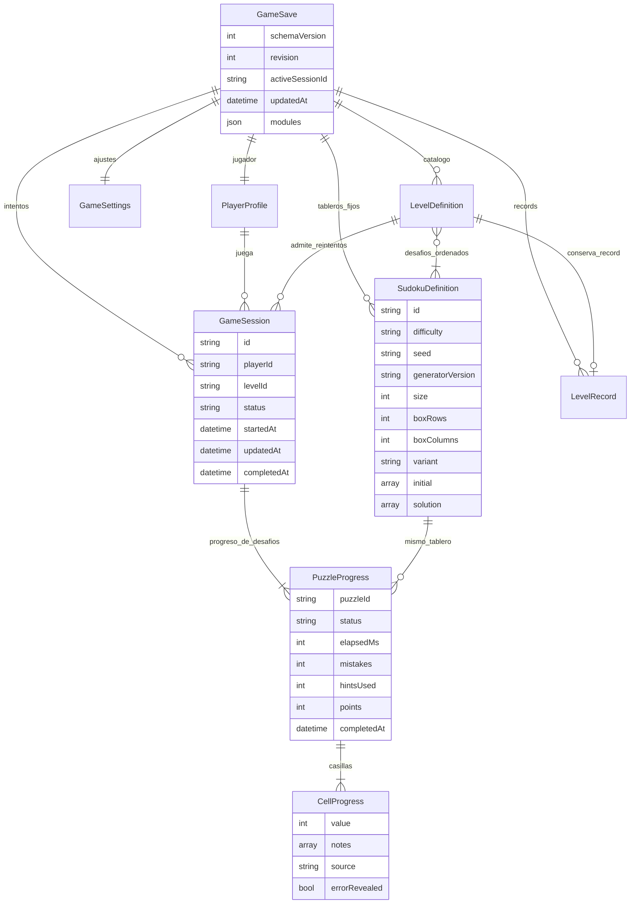
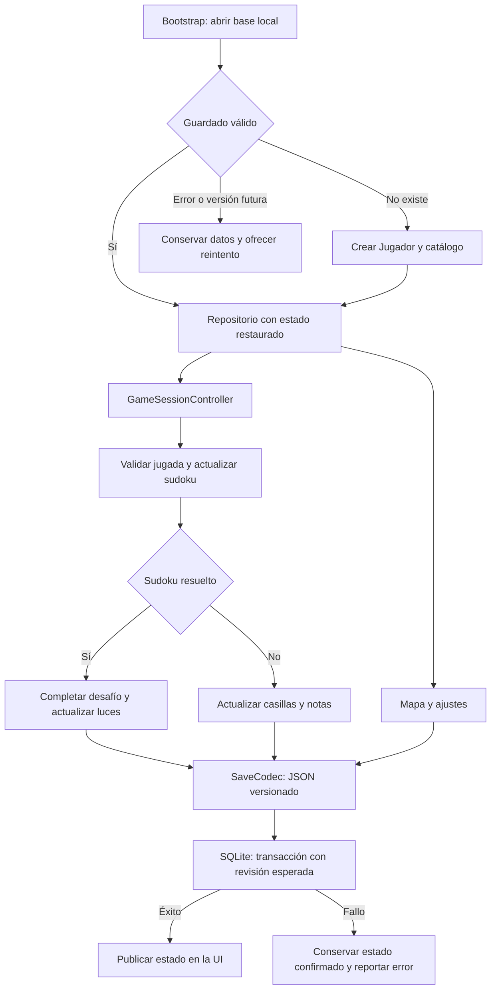

# Guardado local y estados del juego

El progreso se guarda en el dispositivo, sin cuenta ni conexión. El perfil se crea
con un UUID local, nombre **Jugador**, `nameChosen: false` e idioma `es`.
Cambiar el nombre no cambia la identidad ni pierde partidas.

## Modelo de datos


```mermaid
erDiagram
    GameSave ||--|| PlayerProfile : jugador
    GameSave ||--|| GameSettings : ajustes
    GameSave ||--o{ LevelDefinition : catalogo
    GameSave ||--o{ SudokuDefinition : tableros_fijos
    GameSave ||--o{ GameSession : intentos
    GameSave ||--o{ LevelRecord : records
    LevelDefinition }o--|{ SudokuDefinition : desafios_ordenados
    PlayerProfile ||--o{ GameSession : juega
    LevelDefinition ||--o{ GameSession : admite_reintentos
    LevelDefinition ||--o| LevelRecord : conserva_record
    GameSession ||--|{ PuzzleProgress : progreso_de_desafios
    SudokuDefinition ||--o{ PuzzleProgress : mismo_tablero
    PuzzleProgress ||--|{ CellProgress : casillas

    GameSave {
        int schemaVersion
        int revision
        string activeSessionId
        datetime updatedAt
        json modules
    }
    SudokuDefinition {
        string id
        string difficulty
        string seed
        string generatorVersion
        int size
        int boxRows
        int boxColumns
        string variant
        array initial
        array solution
    }
    GameSession {
        string id
        string playerId
        string levelId
        string status
        datetime startedAt
        datetime updatedAt
        datetime completedAt
    }
    PuzzleProgress {
        string puzzleId
        string status
        int elapsedMs
        int mistakes
        int hintsUsed
        int points
        datetime completedAt
    }
    CellProgress {
        int value
        array notes
        string source
        bool errorRevealed
    }
```

Son relaciones del modelo, no tablas SQL individuales. Un nivel puede existir en
el catálogo antes de registrar sus tableros, pero no se puede iniciar hasta tenerlos.

### Reglas

- Cada nivel del mapa declara **tres sudokus**, en orden. La cantidad sale de
  `puzzleIds.length`; otros niveles pueden tener otra cantidad.
- Cada sudoku aprobado aporta una luz dentro de ese intento. En sesiones
  heredadas, resolver ya equivale a aprobar; en desafíos se evalúan sus reglas. Al completar todos
  se termina el intento. Los requisitos del siguiente nivel se evalúan sobre los
  mejores resultados guardados.
- Volver a entrar devuelve la sesión pendiente. Los niveles de aventura ganados
  no admiten repetición, salvo la práctica del nivel 1 del mundo 1. `restart: true`
  conserva esa restricción; no es el reintento de una ronda fallida. Hay una sesión
  pendiente por nivel y `retryRound` solo reinicia el intento fallido de esa ronda.
- Las luces conservan el máximo logrado en un intento. No se suman repeticiones
  del mismo sudoku para desbloquear el siguiente nivel.
- La definición guarda tablero inicial, solución, seed y versión del generador.
  No se puede cambiar una definición registrada bajo el mismo ID. La seed es texto
  para evitar diferencias de precisión entre plataformas.
- Las casillas se ordenan por filas: `index = row * size + column`. `null` significa
  vacío. Las pistas fijas se derivan del tablero inicial y no se editan.
- El error actual se calcula contra la solución. `errorRevealed` conserva si se
  mostró; `mistakes` cuenta entradas incorrectas históricas, aunque se borren.
  Reenviar el mismo valor no incrementa el contador.
- Las notas son candidatos únicos y ordenados. Ingresar un número limpia las notas;
  escribir notas deja vacío el valor. Las ayudas usan la solución y conservan
  `source: hint` y el contador de ayudas.
- `points` y `bestPoints` quedan disponibles con valor cero: todavía no se definió
  una fórmula de puntuación adicional a las luces.
- Tiempo y luces del intento se calculan desde sus desafíos. Intentos jugados y
  completados se pueden contar desde `sessions`, sin duplicar contadores.

## Flujo de guardado


```mermaid
flowchart TD
    A[Bootstrap: abrir base local] --> B{Guardado válido}
    B -->|Sí| C[Repositorio con estado restaurado]
    B -->|No existe| D[Crear Jugador y catálogo]
    B -->|Error o versión futura| E[Conservar datos y ofrecer reintento]
    D --> C
    C --> F[Mapa y ajustes]
    C --> G[GameSessionController]
    G --> H[Validar jugada y actualizar sudoku]
    H --> I{Sudoku resuelto}
    I -->|Sí| J[Completar desafío y actualizar luces]
    I -->|No| K[Actualizar casillas y notas]
    J --> L[SaveCodec: JSON versionado]
    K --> L
    F --> L
    L --> M[SQLite: transacción con revisión esperada]
    M -->|Éxito| N[Publicar estado en la UI]
    M -->|Fallo| O[Conservar estado confirmado y reportar error]
```

`GameRepository` es la entrada de escritura. Serializa operaciones y publica
instantáneas inmutables **después** de confirmar el guardado. `SaveStore` permite
cambiar el almacenamiento sin modificar modelos o pantallas.

SQLite guarda un documento JSON en `game_save`, con `id = 1`, `revision` y `payload`.
Para este juego local pequeño, el documento permite guardar juntos casillas,
finalización y récords. La revisión detecta escrituras desde una instancia que
conserva un estado antiguo y evita sobrescribir cambios más recientes. Un guardado
corrupto o de una versión futura nunca se reemplaza silenciosamente.

`GameSessionController` usa un cronómetro monotónico. Guarda tiempo cada cinco
segundos, antes de cada jugada y al pausar/salir. Lo detiene en segundo plano,
durante escrituras de jugadas y al completar un sudoku. Un cierre forzado puede
perder el intervalo de tiempo aún no confirmado. Nunca cuenta las horas que la app
estuvo cerrada. Una sesión que quedó activa en disco se restaura pausada.

### Plataformas

- Android, iOS y macOS: `sqflite` en el directorio de soporte de la aplicación.
- Linux y Windows: la misma API mediante `sqflite_common_ffi`.
- Web: SQLite WASM persistido en IndexedDB mediante `sqflite_common_ffi_web`.
  Se incluyen `web/sqlite3.wasm` y `web/sqflite_sw.js`. Usar un origen/puerto estable
  al desarrollar: `flutter run -d chrome --web-port 8080`.

El adaptador web está marcado experimental por su autor. Al actualizar SQLite o
el adaptador, regenerar con `dart run sqflite_common_ffi_web:setup --force` y probar
el guardado en navegador. No hay sincronización entre dispositivos. Desinstalar o
borrar datos de la app/navegador puede eliminar el progreso; exportar/importar una
copia queda como extensión futura.

## Conectar la pantalla de sudoku

El catálogo contiene IDs estables para los 10 niveles y sus tres desafíos. El
motor o el contenido del juego proporcionará los tableros reales **una sola vez**
y deberá comprobar que tengan solución única. La persistencia valida números,
filas, columnas, bloques y coherencia del estado; no genera sudokus ni evalúa dificultad.

```dart
await repository.registerPuzzles(levelId, definitions);
final session = await repository.startOrResumeLevel(levelId);
final controller = GameSessionController(repository);
await controller.start(session.id);
await controller.setCell(index, value);
await controller.setNotes(index, [1, 3]);
await controller.useHint(index);
await controller.pause();
// Para el siguiente sudoku: controller.start(session.id).
// Al cerrar la pantalla: controller.dispose().
```

La UI captura los errores de los comandos y ofrece reintento. Los errores de los
checkpoints quedan en `controller.lastError`. Antes de cerrar el repositorio en
una prueba o cierre controlado, esperar `controller.flush()`.

El futuro paso de bienvenida podrá usar `repository.setPlayerName(name)`; un nombre
vacío restaura `Jugador` y deja `nameChosen` en falso.

El mapa y los ajustes ya usan persistencia. Los botones DEV del mapa conservan su
simulación de luces y no inventan partidas reales. La pantalla jugable, el motor,
la fórmula de puntos y el paso para pedir nombre siguen pendientes.

## Evolucionar el formato

1. Agregar campos opcionales con valor predeterminado en `fromJson`.
2. Los campos desconocidos se conservan al leer y volver a escribir cada objeto.
3. Usar `modules` para bloques independientes: `story`, `tutorial`, `achievements`.
   Los datos centrales mantienen modelos y validaciones explícitos.
4. Para cambios incompatibles, incrementar `GameSave.schemaVersion` y registrar
   migraciones en `SaveCodec`. Cada una avanza exactamente una versión. Si falta
   una migración, no se abre ni se borra el guardado.
5. Los IDs son permanentes. Los niveles nuevos se agregan mediante `addLevel`;
   cambiar tableros requiere nuevos IDs y una decisión de migración.

La versión actual del JSON es **2**. `SaveCodec` incluye la migración 1→2 que
marca como `legacy` todas las sesiones existentes, sin recalificar su progreso.
La versión inicial fue 1; antes no existía guardado en disco que migrar. El esquema
SQLite conserva su versión 1 y es independiente del JSON. Si el historial crece,
el repositorio permite separar o archivar intentos sin cambiar las pantallas.

## Verificación

`flutter test` comprueba reapertura de SQLite real, continuidad de partidas,
recompensas sin duplicación, notas, errores, ayudas, reloj y pausa, escrituras
concurrentes, fallos de disco, campos opcionales y migraciones. Las pruebas de
interfaz mantienen las reglas y animaciones previas del mapa.

Referencias: [SQLite en Flutter](https://docs.flutter.dev/cookbook/persistence/sqlite),
[adaptador web](https://pub.dev/packages/sqflite_common_ffi_web).


## Desafíos del mundo 3 (W3-02/03)

La infraestructura está implementada, con creación opt-in por
`GameRepository.open(enableWorld3Challenges: true)` o `GameRepository.memory`.
La app activa el flag desde W3-03 al abrir el repositorio. El constructor conserva
el valor predeterminado `false` para consumidores que no habiliten desafíos.
Este flag no desactiva reglas ya guardadas ni modifica sesiones heredadas.

Cada sesión serializa `rulesMode` (`legacy` o `challenge`). En desafíos, cada
`PuzzleProgress.attempt` contiene token UUID, número de intento, token previo,
reglas versionadas congeladas y resultado estable. El resultado conserva motivo,
puntos, tiempo activo, errores, pistas y fecha; `acknowledged` distingue una
victoria guardada de su presentación reconocida. Campos ausentes o resultados
incoherentes en una sesión nueva se rechazan; no se convierte en modo libre.

Cero vidas, vencimiento y tablero resuelto debajo de la meta producen `failed`,
sin estrella ni desbloqueo. El repositorio confirma resultado, estrella y récord
junto a la jugada terminal en una sola escritura. El contador visual no escribe
puntos ni otorga premios. `pendingResult` bloquea la siguiente ronda hasta
`acknowledgeRoundResult(session, puzzle, attemptId: ...)`, que es idempotente.

`retryRound(session, puzzle, attemptId: ...)` conserva otras rondas y reinicia solo
el tablero fallido, su puntaje, notas, vidas y reloj. Genera otro sudoku de la misma
dificultad y recalibra la meta para su nueva definición.
El token previo permite ignorar un doble toque sin reiniciar otra vez el intento.
No suma puntos fallidos a récords ni habilita repetir niveles ganados.

El controlador confirma tiempo activo antes de la entrada, detiene reloj al fallar
y utiliza un timer dedicado al límite; al pausar/suspender confirma el tramo
pendiente sin contar tiempo oculto. Si falla una escritura conserva el último
estado publicado y permite reintentar el guardado, sin pérdidas ni premios locales
anticipados. Playables mantiene su garantía propia: confirma primero en memoria
y reintenta la sincronización cloud mediante `flush`; no equivale a un ACK remoto.

[Evidencia y límites de plataformas](../design/world-3-crossed-rivers/gameplay-specs/persistence/README.md).


W3-03 presenta el resultado pendiente antes de reanudar. También permite abrir la
tercera victoria de una sesión ya completada para ver su resultado; esto no crea
un intento ni permite repetir el nivel. Tras reconocerla, vuelve a aplicar el
bloqueo de niveles ganados. `challengeStartedAttempt` guarda qué intento pasó
por la confirmación de inicio; las condiciones y el resultado no consumen tiempo.
[Flujo visible y pruebas](../design/world-3-crossed-rivers/gameplay-specs/gameplay/README.md).

### Reentrada y presentación (W3-04–06)

Los reintentos generan un tablero nuevo de la misma dificultad y guardan juntos
su definición, meta recalibrada e intento limpio. Reabrir no regenera el sudoku.
Salir al mapa tras una victoria intermedia reconoce su resultado sin iniciar
el reloj siguiente; la entrada desde el mapa también normaliza victorias
intermedias pendientes de versiones anteriores. El mapa ofrece «Continuar» y
la siguiente ronda ofrece «Jugar» hasta que se haya iniciado. Una ronda iniciada
conserva tablero y pausa, y ofrece «Continuar». Los fallos y la tercera victoria
siguen disponibles con «Ver resultado». La animación solo lee el premio guardado;
restaurar no repite celebración ni concede otra estrella.
